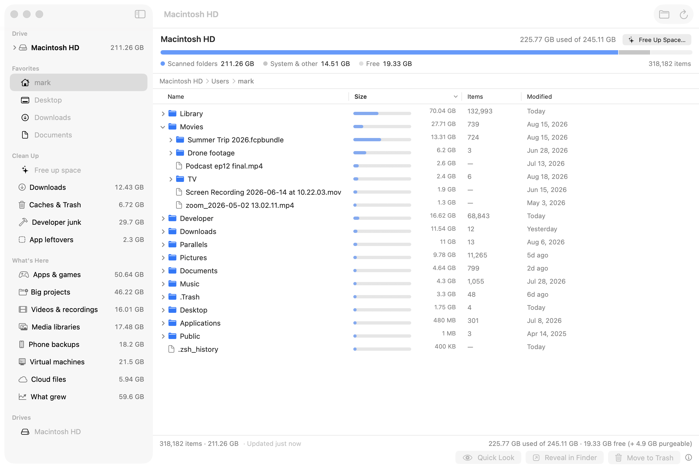

<h1 align="center">Foldscale</h1>

<p align="center">
  <strong>A Finder-native disk space analyzer for macOS.</strong><br>
  No treemap by default. It looks like Finder because you already know how to use Finder.
</p>

<p align="center">
  
  
  
  <em>&nbsp;· Status: v1.3 — signed, notarized, self-updating</em>
</p>

<p align="center">
  <a href="https://foldscale.com/"></a>
</p>

<p align="center">
  <a href="https://foldscale.com/"><strong>foldscale.com</strong></a> ·
  <a href="../../releases/latest">Download</a> ·
  <a href="../../discussions">Discussions</a> ·
  <code>brew install --cask mikehoncho32/foldscale/foldscale</code>
</p>

---

## Why Foldscale

Every folder shows how much space it's eating, everything is sorted biggest-first at every level, and
you can send things to the Trash right from the list. A disk analyzer for people who don't want a
nerd tool.

Existing open-source analyzers lead with a chart and treat the file list as an afterthought. Foldscale
inverts that: a **Finder-identical list view is the product**. The size bar next to each row is
**relative to its parent folder**, so you can drill down without losing scale — the one thing that
separates this from "Finder with a size column."

- **Sort by size, sticky at every depth.** Name / Items / Modified are there too, but size is where you land.
- **Allocated size, not logical size** — what actually frees up when you delete.
- **Cloud-aware.** iCloud/Dropbox online-only placeholders show their real local footprint with a badge; Foldscale never silently downloads them.
- **Task-oriented lists** live in the sidebar as places you go — *Downloads*, *Caches & Trash*, *Developer junk*, *Apps & games*, *Big projects*, *Videos & recordings* — each with a safety badge.
- **Free up space.** Say how much you need; Foldscale pre-ticks the safest candidates to cover it, you adjust, one confirmation.
- **Always current.** The last scan opens instantly and refreshes in the background; the folder you click is re-checked on the spot.
- **Safe by construction.** Every delete routes through the system Trash with a confirmation sheet — never a permanent delete. Protected system paths refuse to be trashed.

## Requirements

- macOS 14 (Sonoma) or later
- Apple Silicon or Intel

## Install

> **Formerly Radix.** The app was renamed to Foldscale in v1.2.0 — an unrelated Mac disk analyzer already
> used the name. Foldscale installs alongside Radix: drag it in, delete the old **Radix.app**, and re-grant
> **Full Disk Access** when asked (macOS treats the renamed app as new). Your last scan and settings carry
> over. Homebrew: `brew uninstall --cask radix-finder && brew install --cask mikehoncho32/foldscale/foldscale`.

Download **`Foldscale-<version>.dmg`** from the [latest release](../../releases/latest), open it, and
drag **Foldscale** into your Applications folder, then double-click it. Releases from v1.1.0 on are
signed with a Developer ID and notarized by Apple, so there's no Gatekeeper warning.

> Running the older unsigned v1.0.0 build? **Right-click the app → Open** the first time.

### Homebrew

```sh
brew install --cask mikehoncho32/foldscale/foldscale
```

Updates arrive with `brew upgrade`; `brew uninstall --cask --zap foldscale` also removes the scan cache
and preferences. The cask lives in [Mikehoncho32/homebrew-foldscale](https://github.com/Mikehoncho32/homebrew-foldscale).

### Updates

Foldscale can keep itself current. On its second launch it asks whether to check foldscale.com for
new versions once a day; you can also pick **Foldscale → Check for Updates…** at any time and change
either behaviour in Settings. The check downloads a small signed feed and sends no identifiers.
Updates are verified twice — Apple Developer ID and an EdDSA key built into the app — so a tampered
download is refused. Versions before 1.3.0 have no updater: download once more, or `brew upgrade`.
Homebrew users: the cask is marked `auto_updates`, so `brew upgrade` leaves in-app updates alone
(`brew upgrade --greedy` forces it).

### Full Disk Access

Foldscale reads file sizes across your disk, which macOS gates behind **Full Disk Access**. On first run
Foldscale detects whether it has been granted and, if not, walks you to
**System Settings → Privacy & Security → Full Disk Access**. Nothing about your files ever leaves your machine — Foldscale
has no telemetry; its only network use is the optional daily update check described under
[Updates](#updates).

### Why no sandbox?

A disk analyzer needs to see the *whole* disk. The App Store sandbox fundamentally can't allow that,
so Foldscale ships **outside the App Store** as a notarized, hardened-runtime app and relies on
user-granted Full Disk Access (a TCC permission, not an entitlement) instead. This is a deliberate,
documented trade-off — see [`docs/decisions/`](docs/decisions).

## Build from source

```bash
# Prerequisites: Xcode 15+, and (for the app target) xcodegen — `brew install xcodegen`
git clone https://github.com/Mikehoncho32/foldscale.git
cd foldscale

# Run the engine's unit tests (Foundation-only, no Xcode UI needed):
swift test

# Generate the Xcode project and build the app:
xcodegen generate
xcodebuild -project Foldscale.xcodeproj -scheme FoldscaleApp -destination 'platform=macOS' build
```

The generated `Foldscale.xcodeproj` is intentionally **not** checked in — `project.yml` (xcodegen) is the
source of truth so CI can build from a clean checkout.

### Dev hooks

Environment variables the app honours, for headless work (screenshots, smoke tests):

| Variable | Effect |
|---|---|
| `FOLDSCALE_SCAN_PATH=/some/folder` | Scan that folder on launch instead of loading the cache |
| `FOLDSCALE_LOG=1` | Print a `FOLDSCALE_SCAN_DONE …` line to stderr when a scan/refresh lands |
| `FOLDSCALE_DEMO=1` | Load a hand-written, realistic demo drive (`Sources/FoldscaleApp/Dev/DemoTree.swift`) — never refreshes, never persists. Used for the website screenshots so no real files appear |
| `FOLDSCALE_APPCAST_URL=http://localhost:8000/appcast.xml` | Use this update feed instead of foldscale.com and skip Sparkle's permission prompt (also turns the updater on in Debug builds) |
| `FOLDSCALE_APPEARANCE=light\|dark`, `FOLDSCALE_WINDOW=1280x800`, `FOLDSCALE_DEMO_VIEW=home\|drive\|freeup\|<smart list>`, `FOLDSCALE_DEMO_EXPAND=1,3` | Demo-mode staging: appearance, window size, destination, outline rows to expand |

## Architecture

Foldscale is split into two pieces:

- **`FoldscaleCore`** — a Foundation-only Swift package: the recursive `fts`-based scanner, the file-node
  model, exclusion rules, smart-list queries, the scan cache, and safe file actions. **Zero UI
  dependencies** (enforced by a test), so it is fully unit-tested in isolation via `swift test`.
- **`FoldscaleApp`** — the SwiftUI + AppKit macOS app (built via xcodegen + xcodebuild).

Performance and design forks (node memory layout, tree-view backend, cache format) are decided by
benchmark and recorded as ADRs in [`docs/decisions/`](docs/decisions).

## Roadmap

What shipped when is in [`CHANGELOG.md`](CHANGELOG.md); how a release is cut is in
[`docs/RELEASING.md`](docs/RELEASING.md).


| Milestone | What |
|---|---|
| 0 | Repo + skeleton, CI, empty app launches |
| 1 | Scanner core: `fts` walk, allocated-size aggregation, hardlink dedupe |
| 2 | Outline view with parent-relative size bars, size sort, progressive scan |
| 3 | Quick Look · Reveal · Copy Path · Get Info · Move to Trash (+ live re-total) |
| 4 | Full Disk Access onboarding, protected paths, cloud placeholders |
| 5 | Smart lists + scan-cache persistence |
| 6 | v1.0: sidebar, footer stats, icon, DMG, release |
| 1.1 | Drive tree sidebar, live refresh, drive overview, task-oriented smart lists, Free up space, notarized DMG |
| 1.1.x | Homebrew tap, landing page ([foldscale.com](https://foldscale.com/)), demo mode for screenshots |

## Contributing

Contributions are welcome — see [CONTRIBUTING.md](CONTRIBUTING.md) and our
[Code of Conduct](CODE_OF_CONDUCT.md). The `docs/decisions/` ADRs explain *why* things are the way
they are; please read the relevant one before proposing a change to scanner or UI internals.

## License

[MIT](LICENSE) © 2026 Foldscale contributors.
